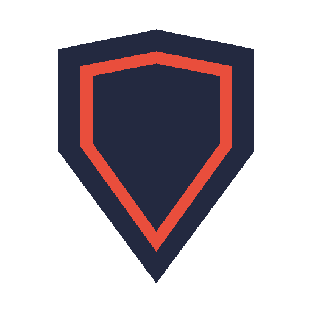

<p align="center">
  
</p>

<h1 align="center">CrowdSec for Home Assistant</h1>

<p align="center">
  <a href="https://github.com/hacs/integration"></a>
  <a href="https://github.com/swater2k/ha-crowdsec/releases"></a>
</p>

A custom integration for the [CrowdSec](https://www.crowdsec.net/) Local API (LAPI): active bans, alert statistics, an event for every new ban — plus optional actions to lift bans and to set manual bans.

> [!NOTE]
> Community project, not affiliated with CrowdSec.

## How it connects

The integration signs in to the LAPI as a **machine** (watcher) and reads alerts. A bouncer key cannot be used: only a machine can read alerts and delete decisions.

It reports only **locally created bans** (origin `crowdsec` and `cscli`). The community blocklist is deliberately left out: it arrives as a few huge alerts with tens of thousands of decisions, which would make every poll several megabytes. The filter is applied by the LAPI, not in Home Assistant.

## Features

- **Active bans**: count, plus the most recent ones with scenario and country as attributes
- **Alerts of the last 24 hours** with the most frequent countries and scenarios as attributes, for a daily summary
- **Bans in the last hour**, for a threshold notification
- **Last ban** with scenario, country, AS, origin and decision ID
- **New ban event**: fires once per banned address or range, not once per alert, and carries all details
- **LAPI reachable** binary sensor
- **Optional actions**, each turned on separately: lift bans and set manual bans
- Fully local polling

## Requirements

- Home Assistant **2026.2** or newer
- CrowdSec with the Local API reachable from Home Assistant (default port `8080`)

## Installation

1. HACS → ⋮ → **Custom repositories** → add `https://github.com/swater2k/ha-crowdsec`, type **Integration**
2. Download **CrowdSec** and restart Home Assistant
3. **Settings → Devices & services → Add integration → CrowdSec**

Manual alternative: copy `custom_components/crowdsec` into your `custom_components` folder and restart.

## Setup

### 1. Let Home Assistant through

If the LAPI sits behind a firewall, allow TCP port `8080` from the Home Assistant host.

### 2. Create a machine

Run this on the CrowdSec host. The credentials go into a file instead of the terminal; delete the file after entering the password:

```bash
umask 077
cscli machines add homeassistant --auto -f /root/ha-machine.yaml
cscli machines list
```

The machine must show as validated. Read the password from the file, enter it in the next step and remove the file with `shred -u`.

### 3. Add the integration

| Field | Default | Description |
|---|---|---|
| LAPI URL | – | Address of the Local API, for example `http://192.168.1.10:8080`. Without a scheme, `http` and port `8080` are assumed. |
| Machine ID | – | The machine created above |
| Password | – | Its password |
| Verify SSL certificate | on | Only relevant for `https` |

The machine ID is used as unique ID, so a changed address can be fixed with **Reconfigure** without losing entities.

### Options

| Option | Default | Description |
|---|---|---|
| Polling interval | `60 s` | How often active bans are read (15–900 s). New bans are reported with this delay. The 24-hour statistics are refreshed every 5 minutes. |
| Control: lift bans | off | Enables the action `crowdsec.delete_decision` |
| Control: set bans | off | Enables the action `crowdsec.add_decision` |

## Entities

Entity IDs have no area prefix. They are built from the name in the language Home Assistant used when the entity was created, so check them under **Settings → Entities**.

| Entity | Type | Notes |
|---|---|---|
| Active bans | sensor | Attribute `bans` lists up to 10 |
| Alerts last 24 hours | sensor | Attributes `top_countries`, `top_scenarios` |
| Bans last hour | sensor | |
| Last ban | sensor | State is the address; attributes `scope`, `origin`, `scenario`, `country`, `asn`, `decision_id`, `banned_at` |
| New ban | event | Event type `ban` |
| LAPI reachable | binary sensor (diagnostic) | Stays available during an outage and turns off |

Alerts without a ban (for example from allowlisted addresses) are not counted: the statistics only cover alerts that led to a local ban.

### The new ban event

Each event carries `value`, `scope` (`Ip` or `Range`), `origin` (`crowdsec` or `cscli`), `scenario`, `country`, `asn`, `decision_id`, `banned_at`, `duration` (remaining) and `expires_at`. The first poll after a restart reports nothing, so a restart does not announce every active ban as new. At most 25 events are reported per poll.

```yaml
triggers:
  - trigger: state
    entity_id: event.crowdsec_new_ban
conditions:
  - condition: template
    value_template: "{{ trigger.to_state.attributes.origin == 'cscli' }}"
actions:
  - action: notify.notify
    data:
      message: "Manual ban: {{ trigger.to_state.attributes.value }}"
```

## Actions

| Action | Needs option | Description |
|---|---|---|
| `crowdsec.delete_decision` | Control: lift bans | Delete the decisions for an address or CIDR range. A single address also lifts ranges that contain it, like `cscli decisions delete --ip`. Returns `deleted`, the number of removed decisions. |
| `crowdsec.add_decision` | Control: set bans | Ban an address or range, with a duration (Go notation with `ms`, `s`, `m`, `h`, for example `4h`; days are not supported) and a reason |

```yaml
action: crowdsec.delete_decision
data:
  ip: 203.0.113.7
response_variable: result
```

## Removal

1. **Settings → Devices & services → CrowdSec → ⋮ → Delete**
2. Remove the machine on the CrowdSec host with `cscli machines delete homeassistant`
3. Remove the repository in HACS and restart Home Assistant

## Troubleshooting

- **"The LAPI is not reachable"**: check address, port and the firewall rule for the Home Assistant host.
- **"Machine ID or password rejected"**: the machine is probably not validated yet. Run `cscli machines validate <name>` and check `cscli machines list`.
- **A ban is not reported**: bans from the community blocklist are never reported. Everything else shows up within one polling interval.
- **Diagnostics**: Settings → Devices & services → CrowdSec → ⋮ → Download diagnostics. URL, machine ID, password and all addresses are redacted.

```yaml
logger:
  logs:
    custom_components.crowdsec: debug
```

## License

[MIT](LICENSE)
